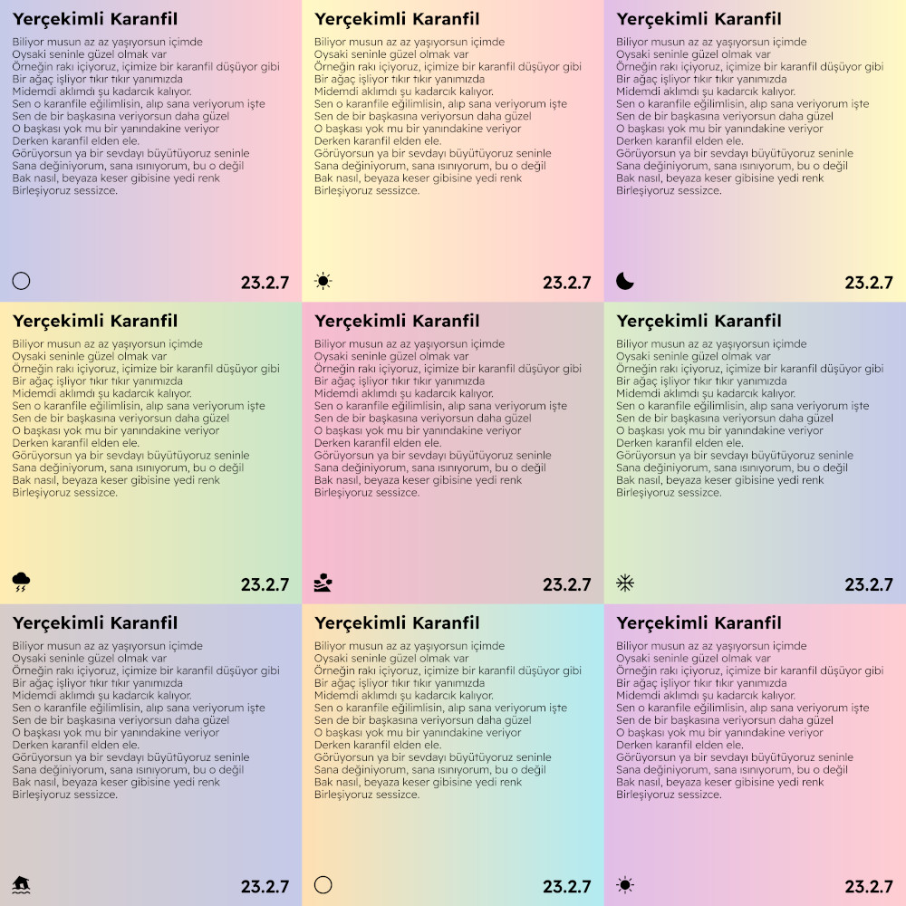

# ✍ poemake(g)r

__poemakegr:__ Creates a square gradient with text.

__poemaker:__ Creates solid colored square with text.

## ⚙️ Usage

- Download [Readex Pro](https://fonts.google.com/specimen/Readex+Pro) font and copy the __static__ fonts to `$HOME/.local/share/fonts`
- Create `poemaker` directory at `$HOME/.local/share`
- Create gradients:
  1. Run `create-gradients` script,
  2. Copy `light-bg` and `dark-bg` folders to `$HOME/.local/share/poemaker`
- Copy the `icons` folder to `$HOME/.local/share/poemaker`
- Copy the script to `$PATH`
- Run `poemakegr <text-file-name.txt>`

## 💡 FAQ

### Why is this repo gigantic in size?

Because of my old commit where I added a 6000x6000(px) PNG file 😬. Use `Download ZIP` from the `Code` menu instead of cloning the repository.

### What are these used for?

For making poem posts for my [Instagram](https://www.instagram.com/dybdeskarphet).

## 🖼️ Screenshots

### Poemakegr

### Poemaker

