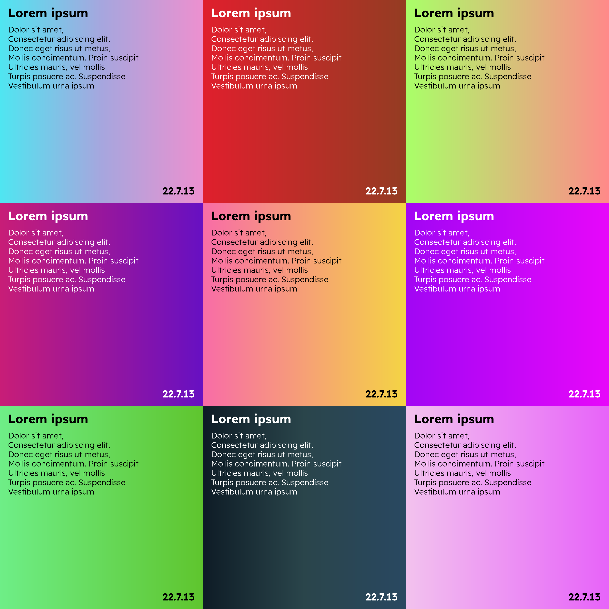
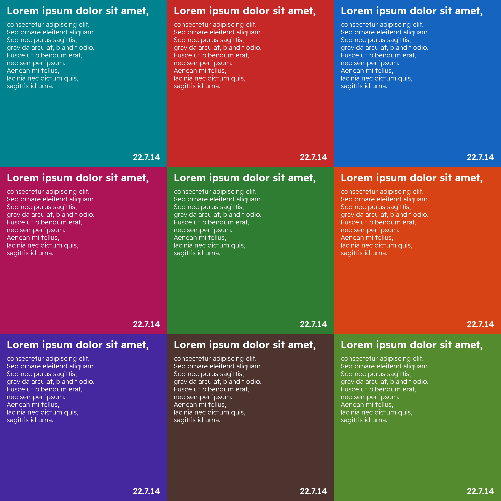

# poemaker / poemakegr
__poemakegr:__ Creates a square gradient with text. 

__poemaker:__ Creates solid colored square with text. 

## What are these used for?
For making poem posts for my [Instagram](https://www.instagram.com/dybdeskarphet.siir).

# Usage
- Download [Readex Pro](https://fonts.google.com/specimen/Readex+Pro) font and copy the __static__ fonts to `$HOME/.local/share/fonts`
- Move `gradients` folder to `$HOME/.local/share` if you're going to use __poemakegr__
- Copy the script to `$PATH`
- Run `poemakegr <text-file-name.txt>`

# Screenshots
## Poemakegr

## Poemaker

